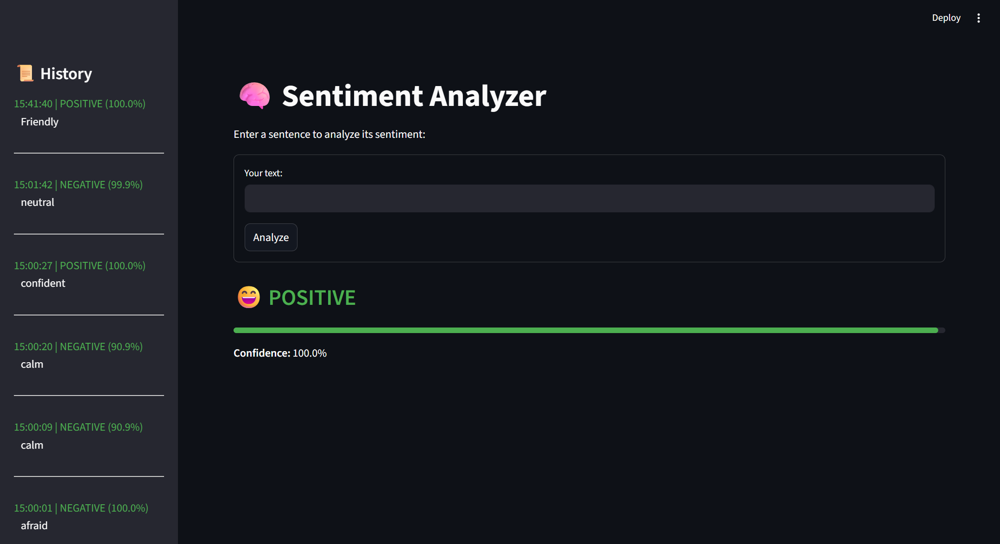
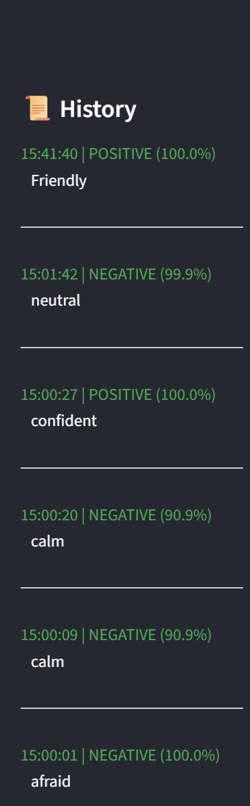

# Sentiment Analyzer v1

Author: NIKABOU NADJOMBE  
Date: 2025-09-24  
1️⃣ README.md
🧠 **AI-powered real-time sentiment analyzer** built with Python and Streamlit.  
Visualizes sentiment as **POSITIVE, NEUTRAL, NEGATIVE**, shows **confidence scores**, and maintains a **history of analyzed sentences**.

---

## Features

- Real-time sentiment analysis using Hugging Face Transformers
- Interactive **Streamlit dashboard**
- Visual indicators:
  - Emojis 😄😐😢 according to sentiment
  - Horizontal KPI-style confidence bars
- History panel to track previous analyses
- Dark/light mode toggle
- Clear input field after each submission

---

## Installation

1. Clone this repository:

```bash
git clone https://github.com/LucNIK/sentiment-analyzer-v1.git
cd sentiment-analyzer
```
2. Create a virtual environment (optional but recommended):

```bash

python -m venv venv
.\venv\Scripts\activate   # Windows
source venv/bin/activate  # Mac/Linux

```
3. Install dependencies:

```bash

pip install --upgrade pip
pip install -r requirements.txt
```

4. Make sure you have a Hugging Face token for private models (if needed):

```bash

huggingface-cli login

```

Usage
```bash


streamlit run app.py
Enter a sentence in the input box

Click Analyze

View sentiment, confidence bar, emoji, and history

Dark/light mode toggle available in the sidebar
```
Screenshots

## Screenshots

### Main Interface


### History Panel


### Dark Mode


Tech Stack & Skills Demonstrated

. Python 3.11+

. Streamlit for interactive UI

. Hugging Face Transformers (sentiment analysis pipeline)

. PyTorch / TensorFlow

. Session management with st.session_state

. Custom CSS styling for modern UI

. Real-time sentiment analysis visualization


Requirements
See requirements.txt for all dependencies.
```bash
txt

streamlit>=1.26.0
transformers>=4.35.0
torch>=2.1.0
tensorflow>=2.14.0
tf-keras>=2.14.0
numpy>=1.26.0
pandas>=2.1.0

``` 
License
```bash
MIT License

yaml
```

---
